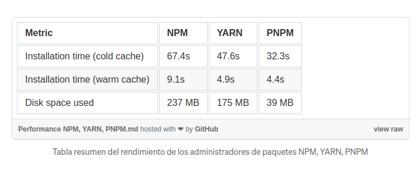
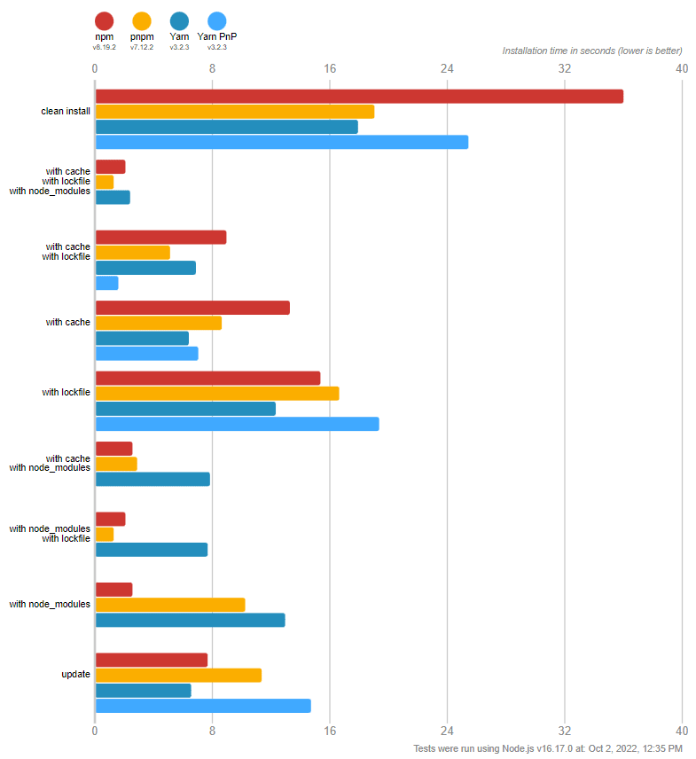

# Gestor de dependencias

Trás la elección del runtime, se debe determinar un gestor de dependencias para el proyecto para cubrir las necesidades mencionadas en el guión. Por lo tanto se presentan las siguientes:

## Criterios de elección

En cuanto a los criterios de la elección:

-   Seguridad : Buscamos que se solventen problemas de dependencias de paquetes o trabajar tediosamente a más de un nivel en cuanto a dependencias. 
-   Comportamiento : Que presente unas prestaciones más que aceptables en cuanto a eficiencia y complejidad mínima.

## NPM (Node Package Manager)

Se trata de un gestor de dependencias que viene por defecto en node. Es el más usado pero presenta las siguientes características:

-   Al ser más antiguo que otros, es lento con respecto a los mencionados más abajo.
-   Auditoría para consultar vulnerabilidades en dependencias.
-   Posibilidad de crear dependencias duplicadas que ocupan espacio y crean conflictos.
-   Presenta una sintaxis sencilla por lo general.

## Yarn

Trata principalmente de mejorar aquellos problemas de velocidad, seguridad y fiabilidad de NPM. 

-   Utiliza una estructura de dependencia plana para evitar duplicados de paquetes. Esto mejora la velocidad como se ha comentado porque no se necesita buscar entre directorios las distintas dependencias. Es decir, se trabaja a un mismo nivel.
-   El trabajar a un único nivel, evita conflictos de dependencias.
-   Instalación de paquetes desde caché local(sin conexión).

## PNPM (Parallel Node Package Manager)

Resulta ser el más ligero, rápido y seguro de los 3. Es bastante similar a Yarn y NPM en cuanto a la sintaxis y utiliza igualmente el archivo package.json.

-   Los paquetes nunca son guardados mas de una vez en disco debido a la posibilidad de usar enlaces simbólicos (no sería un factor preocupante pero si relevante en cuanto a la velocidad la cual mejora).
-   Presenta herramienta de auditoria que busca vulnerabilidades con respecto a dependencias.
-   De los 3, presenta la misma verificación con respecto a la integridad y autenticidad de paquetes que llega a instalar (SHA-512) que NPM pero mejor que Yarn (SHA-1).
-   Sintaxis relativamente sencilla, parecida a la de NPM.

## Elección

Tras el estudio realizado de las principales alternativas que se presentan como gestores de dependencias, elijo PNPM. Basicamente, me parece una opción más que correcta para el desarrollo de este proyecto por su velocidad en el papel y seguridad. Es ligero. Además, se tienen las mejores características de NPM y Yarn pero quitando las vulnerabilidades y obteniendo lo mejor de estos. 

## Algunas curiosidades...

Se presentan algunos comportamientos que tienen los gestores de dependencias con respecto al rendimiento y eficiencia en disco:

